```mermaid
graph TD
    subgraph "Attacker Realm"
        A[Hacker / Red Team] -->|SSH Connection :2223| B(The Trap)
    end

    subgraph "AEGIS Deception Grid (Cloud)"
        B[Pillar II: Chameleon Honeypot] -->|Logs Keystrokes| C[(Audit Log Stream)]
        C -->|Real-time Ingestion| D{Pillar III: The Brain}
        
        D --"Anomaly Score < -0.5"--> E[🚨 Threat Detected]
        D --"Anomaly Score > 0.0"--> F[✅ Normal Behavior]
        
        E -->|1. Update Blacklist| B
        E -->|2. Trigger Alert| G[Pillar IV: Dashboard]
    end

    subgraph "Defense Mechanisms"
        B --"Reads Blacklist"--> H[🚫 Connection Terminated]
        G --"Visualizes Attack"--> I[SOC Analyst / User]
    end
    
    style E fill:#ff4b4b,stroke:#333,stroke-width:2px,color:white
    style D fill:#2b2d42,stroke:#8d99ae,stroke-width:2px,color:white
    style B fill:#2b2d42,stroke:#8d99ae,stroke-width:2px,color:white
```

# 🛡️ Persistent Threat Shield (PTS)
> **Autonomous Cognitive Deception Grid & Active Defense System**
Active Defense System utilizing eBPF for deep kernel observability and AI-driven deception grids to neutralize advanced persistent threats (APTs).

[]()
[]()
[]()

## 📜 Project Overview
**Persistent Threat Shield (PTS)** is a next-generation "Active Defense" security system designed to neutralize Advanced Persistent Threats (APTs) using deception technology and unsupervised machine learning. 

Unlike traditional firewalls that passively block ports, PTS engages attackers in a high-interaction **Chameleon Honeypot**, gathers forensic intelligence on their behavior, and uses an **Isolation Forest AI** to autonomously "Kill" connections that deviate from baseline norms.

---

## 🏗️ System Architecture

### **Pillar I: The Trap (Chameleon Honeypot)**
* **Technology:** Python `paramiko` (Custom Implementation)
* **Function:** Simulates a vulnerable Ubuntu 22.04 server. It accepts all passwords but records every keystroke, command, and payload attempted by the adversary.
* **Capabilities:** Mimics realistic shell responses (`ls`, `whoami`, `pwd`) to prolong attacker engagement.

### **Pillar II: The Brain (Cognitive Engine)**
* **Technology:** `scikit-learn` (Isolation Forest)
* **Function:** Analyzes command logs in real-time. It calculates a generic "Anomaly Score" based on command length, time of day, and sensitivity (e.g., attempts to access `/etc/shadow`).
* **Response:** If `Score < Threshold`, it issues an automated **Kill Order** to the Blacklist.

### **Pillar III: The Dashboard (Transparency Grid)**
* **Technology:** Streamlit + Plotly
* **Function:** A "War Room" interface providing real-time visualization of attack vectors, AI confidence scores, and immutable forensic audit trails.

---

## 🚀 Quick Start (Simulation)

### 1. Prerequisites
* Python 3.10+
* 3 Terminal Windows (or Split Terminals)

### 2. Installation
```bash
git clone [https://github.com/YOUR_USERNAME/persistent-threat-shield.git](https://github.com/YOUR_USERNAME/persistent-threat-shield.git)
cd persistent-threat-shield
pip install -r requirements.txt

## 🏗️ System Architecture

